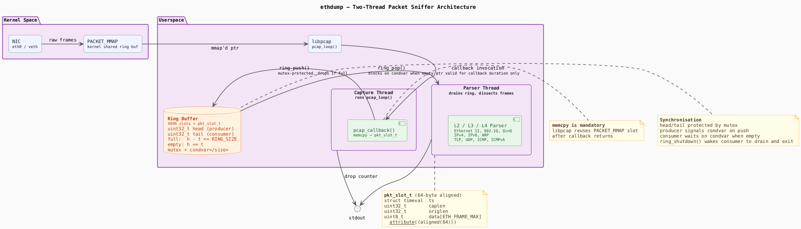

# ethdump
ethdump is a simple ethernet packet sniffer for sniffing packets over any ethernet 
interface and print the protocol information upto Layer 4 in a human readable format. 

# Motivation

Like tcpdump, ethdump uses libpcap for packet capture. However, tcpdump performs both 
packet parsing and printing inside the libpcap callback, on the same thread as capture. 
Under high packet rates this causes drops as slow printing blocks the callback, the 
kernel ring buffer fills up, and packets are lost before they reach userspace.

ethdump separates capture from parsing using a two-thread producer/consumer architecture.
The ring buffer topology is essentially single producer single consumer (SPSC), however
on Arm architectures the memory ordering is not strict and hence a mutex is still used.
At this time, adding memory fences didnt seem like a possibilty as they are error prone
and can introduce subtle bugs.

The capture thread runs pcap_loop() and does nothing in the callback except copy the frame 
into a ring buffer. A separate parser thread drains the ring, dissects L2/L3/L4 headers, 
and prints output. This keeps the capture path as short as possible.

The mandatory copy exists because libpcap reuses its internal PACKET_MMAP kernel buffer after 
the callback returns, invalidating the packet pointer. The ring buffer is statically allocated 
(4096 slots × ~1.5 KB each ≈ 6 MB), so the memory cost is fixed and bounded.

# Building

**Dependencies**
```bash
sudo apt install libpcap-dev cmake git
```

```bash
mkdir build && cd build
cmake ..
make -j
sudo ./ethdump -i eth0
```

# Testing

Unit tests use the [Unity](https://github.com/ThrowTheSwitch/Unity) framework, fetched automatically by CMake.

```bash
mkdir build && cd build
cmake .. -DBUILD_TESTING=ON
make -j
ctest --output-on-failure
```

# Git hooks

A pre-commit hook enforces clang-format on all staged `.c` and `.h` files. Run once after cloning:

```bash
chmod +x .githooks/pre-commit
git config core.hooksPath .githooks
```

# Architecture



# Comparison with tcpdump

For comparison between the performance of ethdump and tcpdump, iperf3 is used. Along with that
perf tool is used to profile the cpu consumption of both the applications.

## Environemnt:

Two devices were used, a RaspberryPi 3B+ and a Windows machine running WSL2. Both connected via
a wired connection. RaspberryPi is at IP 192.168.19.52 and Windows at 192.168.19.50.

WSL2 on Windows acts as an iperf3 client
```
iperf3 -c 192.168.19.52  -p 5202 -u -i 0.5 -t 10 -b <BitRate>
```
iperf3 server on RaspberryPi
```
iperf3 -s -p 5202
```

Command to run ethdump on RaspberryPi
```
sudo perf stat ./ethdump -i eth0
```


## perf stats

CPU Time          : Time spent in user space
SYS Time          : Time spent in kernel space
Cycles            : Total instruction cycles consumed
IPC               : instructions per cycle
Branch miss rate  : branch predictor misprediction rate

| Rate  | Metric               | ethdump       | tcpdump      |
| ----- | -------------------- | ------------- | ------------ |
| 10M   | CPU time             | 323ms         | 355ms        |
|       | SYS time             | 337ms         | 602ms        |
|       | Cycles               | 515M          | 799M         |
|       | IPC                  | 0.57          | 0.46         |
|       | Branch miss rate     | 9.38%         | 16.52%       |
| 30M   | CPU time             | 800ms         | 704ms        |
|       | SYS time             | 1.05s         | 1.32s        |
|       | Cycles               | 1.6B          | 2.4B         |
|       | IPC                  | 0.55          | 0.44         |
|       | Branch miss rate     | 10.09%        | 16.96%       |
| 50M   | CPU time             | 0.91s         | 1.02s        |
|       | SYS time             | 1.65s         | 2.32s        |
|       | Cycles               | 3.01B         | 4.0B         |
|       | IPC                  | 0.52          | 0.42         |
|       | Branch miss rate     | 10.47%        | 17.75%       |
| 70M   | CPU time             | 1.62s         | 1.89s        |
|       | SYS time             | 3.02s         | 4.21s        |
|       | Cycles               | 5.44B         | 7.4B         |
|       | IPC                  | 0.51          | 0.42         |
|       | Branch miss rate     | 10.98%        | 18.41%       |
| 100M  | CPU time             | 2.39s         | 2.01s        |
|       | SYS time             | 4.74s         | 5.04s        |
|       | Cycles               | 8.35B         | 8.5B         |
|       | IPC                  | 0.51          | 0.42         |
|       | Branch miss rate     | 11.02%        | 18.16%       |
| 120M  | CPU time             | 2.38s         | 2.28s        |
|       | SYS time             | 5.12s         | 4.76s        |
|       | Cycles               | 8.80B         | 8.5B         |
|       | IPC                  | 0.51          | 0.42         |
|       | Branch miss rate     | 10.98%        | 18.14%       |


## packet capture stats

| Rate  | ethdump captured | ethdump processed | ethdump kernel dropped | ethdump dropped        | tcpdump total | tcpdump captured | tcpdump dropped |
| ----- | ---------------- | ---------------- | ---------------------- | ----------------------- | ------------- | ---------------- | --------------- |
| 10M   | 11729            | 11729            | 0                      | 0                       | 13750         | 13750            | 0               |
| 30M   | 36111            | 36111            | 0                      | 0                       | 38842         | 38842            | 0               |
| 50M   | 61232            | 61232            | 0                      | 0                       | 63491         | 63491            | 0               |
| 70M   | 103987           | 103987           | 0                      | 0                       | 106745        | 106745           | 0               |
| 100M  | 158367           | 152723           | 0                      | 5644                    | 143949        | 124542           | 19395           |
| 120M  | 169856           | 146944           | 0                      | 22912                   | 161149        | 123629           | 37506           |

`ethdump captured` refers to the number of frames that reached userspace and were attempted to push to the ring. 
`ethdump processed` refers to the number of frames that were popped from the ring and printed out.
`ethdump dropped` refers to the number of frames that coudl not be pushed to the ring.

Note: Above table doesnt contain the packets captured at kernel space for ethdump as there were no drops seen in the kernel space. 